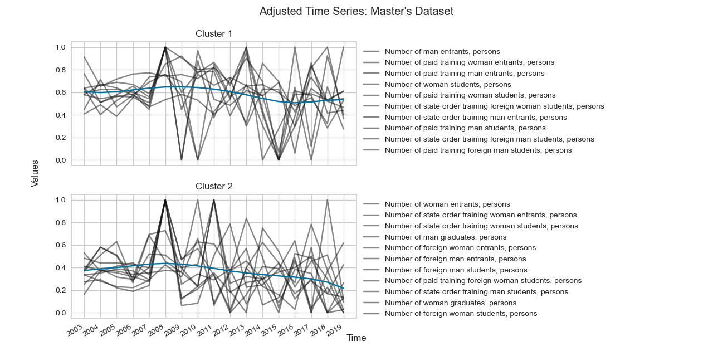
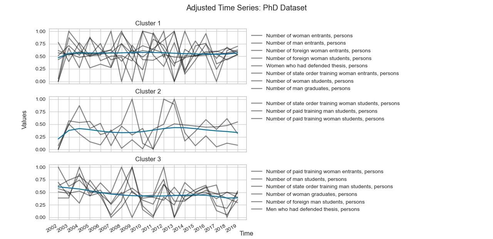

### 
To run the project, from your command line do:
1. `git clone https://github.com/karen-gishyan/time-series-clustering.git`to an existing local directory or 
download the zip and extract to  the same local directory (folder).
2. Change the current working directory to your local directory by doing `cd path_to_your_local_dir` from the command line.
3. If you have python installed and added in your system path, from the command line do:
    1. `pip install requirements.txt`
    2. `python run.py`   
4. For checking a few sample decomposed time series plots, do:
    1. `python time_series.py`
5. Among other results, the following plots will be displayed.
6. 	
7. 	

